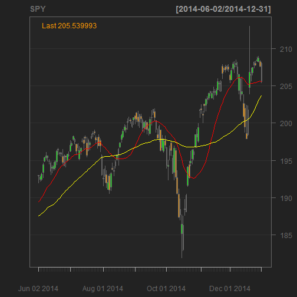

Stock Moving Average Crossover System - Data Application
========================================================
author: Thomson Kneeland
date: 7/6/16
transition: rotate
The Two Moving Average Crossover System
========================================================
incremental: true
-In the world of stock trading, investors often look for mathematical systems with which they can assess
when to buy and sell specific stocks.

-One quite common system is a "two moving average crossover system", in which a shorter and longer
moving average will be used to signal entries and exits into a specific equity (stock)

-When the shorter of the two moving averages "crosses" over the longer moving average, it is seen a signal
to buy or sell depending upon the direction of the crossover. Very often, this signal will be assessed in conjunction with other
indicators to determine whether to enact a trade.

Example
========================================================
left: 35%
In this SPY example, we examine a 20 day moving average(red)
in relation to a 50 day moving average (yellow).  One would assess equity strength while the 20DMA remains above the 50DMA and weakness when it crosses below.
***

Further Specifics on the System
========================================================
incremental: true

-This application can be used as a means of exploring different pairs of moving averages as one seeks a profitable system that suits their investing style and timeframe.  Input a stock ticker, two moving average lengths and a date range, and make your own assessment of potential profitability.

-This type of system is often used for "trend following": buying strength and momentum and holding until a sell signal is generated.

-To the seasoned trader, the slope of the trend can be as important in gauging the momentum and strength of a move or crossover.  Different moving averages will yield different results and different traders may gather different conclusions.

Notes on The Application
========================================================
incremental: true
-This application uses data from the yahoo finance database and requires the quantmod package, a package with many useful financial/
statistical applications

-This application was developed for the Coursera Developing Data Products course project and is not a recommendation of the system itself. The application is intended for data exploration only.

-The interactive application can be accessed at https://tktrader.shinyapps.io/ShinyProject/

-code for the project can be found at https://github.com/TKTrader/DevelopingDataProductsProject
